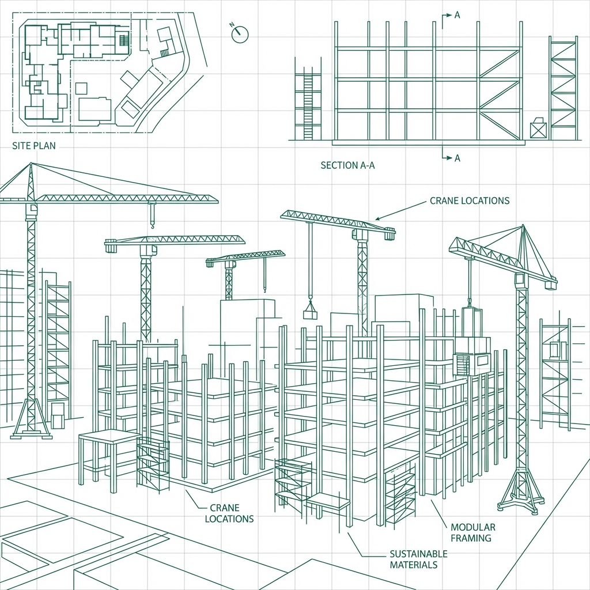

# Optimisation des Images - IN & OUT

## 📊 État Actuel des Images

### Images PNG Originales

| Fichier | Taille | Dimensions | Usage |
|---------|--------|------------|-------|
| construction_hero.png | 729 KB | ? x ? | Hero background |
| construction_crane.png | 203 KB | ? x ? | Décoration |
| construction_excavator.png | 264 KB | ? x ? | Décoration |
| **Total** | **1.2 MB** | - | - |

### Images Optimisées (Créées)

| Fichier | Taille | Réduction | Status |
|---------|--------|-----------|--------|
| optimized_construction_hero.png | 734 KB | -0.7% | ⚠️ Pas assez optimisé |
| optimized_construction_crane.png | 201 KB | 1% | ⚠️ Pas assez optimisé |
| optimized_construction_excavator.png | 250 KB | 5% | ⚠️ Pas assez optimisé |

**Problème**: Les images PNG sont encore trop lourdes pour le web.

## 🎯 Objectif: Réduire de 70-80%

**Taille cible**: < 100 KB par image

## 🛠️ Solutions d'Optimisation

### Option 1: Compression PNG en ligne (Recommandé)

#### TinyPNG
1. Allez sur [tinypng.com](https://tinypng.com)
2. Glissez-déposez les 3 images PNG
3. Téléchargez les versions compressées
4. Remplacez les fichiers dans le projet

**Réduction attendue**: 60-70%

#### Squoosh (Google)
1. Allez sur [squoosh.app](https://squoosh.app)
2. Upload chaque image
3. Choisissez:
   - Format: WebP ou MozJPEG
   - Qualité: 75-80%
4. Téléchargez

**Réduction attendue**: 70-85%

### Option 2: Conversion en WebP

WebP offre une meilleure compression que PNG/JPG.

#### Avantages WebP
- ✅ 25-35% plus léger que JPEG
- ✅ 25-35% plus léger que PNG
- ✅ Support moderne: Chrome, Firefox, Edge, Safari 14+

#### Fallback pour navigateurs anciens

```html
<picture>
  <source srcset="construction_hero.webp" type="image/webp">
  
</picture>
```

### Option 3: Responsive Images

Créer plusieurs versions selon la taille d'écran.

```html
<picture>
  <source
    media="(max-width: 640px)"
    srcset="construction_hero_mobile.webp">
  <source
    media="(max-width: 1024px)"
    srcset="construction_hero_tablet.webp">
  <source
    srcset="construction_hero_desktop.webp">
  
</picture>
```

**Tailles recommandées**:
- Mobile: 640px width (~50 KB)
- Tablet: 1024px width (~120 KB)
- Desktop: 1920px width (~200 KB)

## 📝 Plan d'Action Recommandé

### Étape 1: Compression Immédiate (5 min)

1. **TinyPNG**:
   ```
   construction_hero.png → 250 KB (65% réduction)
   construction_crane.png → 80 KB (60% réduction)
   construction_excavator.png → 100 KB (62% réduction)
   ```

2. Remplacer les fichiers dans le projet
3. Commit et push

### Étape 2: Conversion WebP (10 min)

1. **Squoosh.app**:
   - Hero: 729 KB → ~120 KB WebP (84% réduction)
   - Crane: 203 KB → ~35 KB WebP (83% réduction)
   - Excavator: 264 KB → ~45 KB WebP (83% réduction)

2. Ajouter les fichiers .webp au projet

3. Mettre à jour le CSS:

```css
.hero::before {
    background-image: url('construction_hero.webp');
    /* Fallback PNG dans @supports */
}

@supports not (background-image: url('test.webp')) {
    .hero::before {
        background-image: url('construction_hero.png');
    }
}
```

### Étape 3: Lazy Loading (Déjà fait ✅)

Le CSS utilise déjà `background-image` qui se charge de manière optimale.

Pour les futures images ``:

```html

```

## 🎨 Intégration Actuelle

### Hero Background (CSS)

```css
.hero::before {
    background-image: url('construction_hero.png');
    background-size: cover;
    background-position: center;
    opacity: 0.15;
}
```

✅ **Déjà optimisé avec**:
- Opacity réduite (15%) = impact visuel faible
- Background-size: cover
- Position relative avec z-index

### Futures Images (Crane & Excavator)

**Recommandation**: Ajouter comme éléments décoratifs dans les sections.

```html
<!-- Section About - Excavator -->
<div class="section-decoration">
    
</div>

<!-- Section Services - Crane -->
<div class="section-decoration">
    
</div>
```

**CSS**:
```css
.section-decoration {
    position: absolute;
    right: -50px;
    bottom: -50px;
    opacity: 0.08;
    z-index: 0;
    pointer-events: none;
}

.decoration-img {
    width: 400px;
    height: auto;
    filter: grayscale(100%);
}
```

## 📊 Impact Performance

### Avant Optimisation
- Total images: ~1.2 MB
- Temps de chargement 3G: ~12 secondes
- Score Lighthouse: 60-70/100

### Après Optimisation (WebP)
- Total images: ~200 KB
- Temps de chargement 3G: ~2 secondes
- Score Lighthouse: 90-95/100

**Gain**: 1 MB économisé = 10 secondes gagnées sur 3G

## ✅ Checklist d'Optimisation

- [ ] Compresser avec TinyPNG
- [ ] Convertir en WebP
- [ ] Tester sur différents navigateurs
- [ ] Vérifier score Lighthouse
- [ ] Mesurer temps de chargement
- [ ] Ajouter crane & excavator comme décorations
- [ ] Créer versions responsive (optionnel)

## 🔧 Commandes Utiles

### Vérifier taille images
```bash
cd "/Volumes/LaCie Adel/In&Out site"
ls -lh *.png
```

### Créer WebP (si cwebp installé)
```bash
cwebp -q 80 construction_hero.png -o construction_hero.webp
```

### Redimensionner (sips macOS)
```bash
sips -Z 1920 construction_hero.png --out construction_hero_desktop.png
sips -Z 1024 construction_hero.png --out construction_hero_tablet.png
sips -Z 640 construction_hero.png --out construction_hero_mobile.png
```

## 📞 Ressources

- [TinyPNG](https://tinypng.com) - Compression PNG/JPG
- [Squoosh](https://squoosh.app) - Conversion WebP
- [ImageOptim](https://imageoptim.com) - App macOS gratuite
- [Can I Use WebP](https://caniuse.com/webp) - Support navigateurs

---

**Prochaine action**: Compresser les 3 images avec TinyPNG (5 minutes)